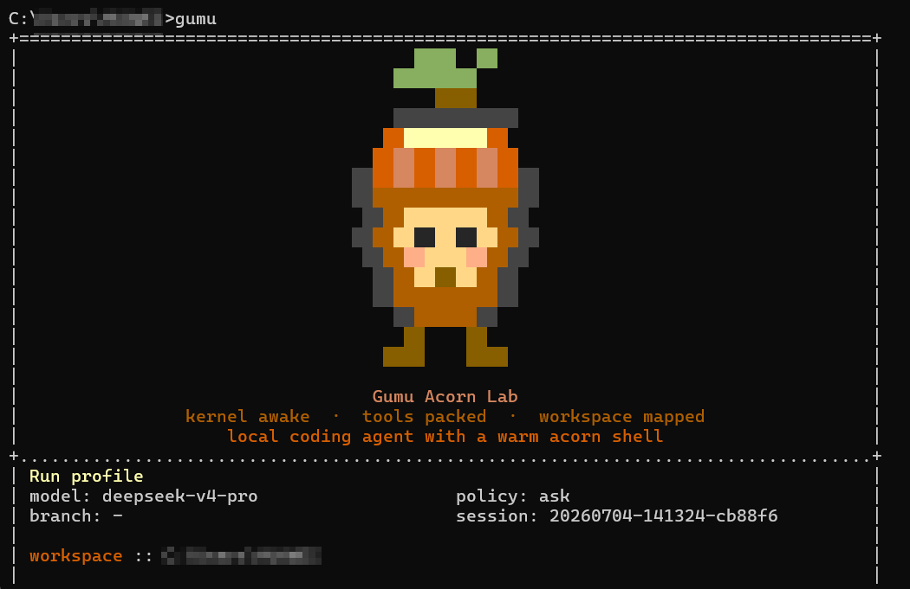

# Gumu Acorn Lab

Gumu Acorn Lab 是一个运行在本地终端里的代码仓库智能助手。它面向真实工程目录工作：启动后会读取当前工作区，按需调用受控工具读取文件、修改代码、执行命令，并把会话、任务轨迹和运行报告保存在本地 `.gumu/` 目录中。

这个项目是基于本地 coding agent 思路做的版本，重点放在三件事上：

- 更适合个人项目展示的 CLI 品牌化启动体验，包括像素橡果吉祥物和独立的信息面板。
- 面向仓库的语义上下文管理，尽量把模型注意力放在与当前任务相关的文件、历史和记忆上。
- 可审计的本地执行链路，保留 session、trace、report，便于复盘一次 agent 任务做了什么。



## 项目亮点

- **终端交互式 Agent**：输入 `gumu` 后进入 REPL，可以连续提问、检查仓库、请求修改代码或运行任务。
- **多模型后端**：支持 DeepSeek、OpenAI-compatible、Anthropic-compatible 和本地 Ollama。
- **语义上下文管理**：通过工作区快照、历史压缩、相关记忆选择，减少无关上下文占用。
- **安全审批策略**：对 shell 执行、文件写入等高风险操作使用 `ask`、`auto`、`never` 三种审批模式控制。
- **本地持久化**：会话保存在 `.gumu/sessions/`，任务运行记录保存在 `.gumu/runs/`。
- **品牌界面**：启动页使用像素橡果吉祥物、`Gumu Acorn Lab` 文案和新的运行信息排版，清晰展示。

## 技术栈

- Python 3.10+
- setuptools console scripts
- uv 环境和工具安装
- 自研轻量 runtime / tool executor / context manager
- 可插拔 provider client：
  - DeepSeek Anthropic-compatible API
  - OpenAI-compatible Responses API
  - Anthropic-compatible Messages API
  - Ollama 本地模型

## 安装

克隆项目后进入仓库：

```bash
git clone https://github.com/chagumu-01/gumu.git
cd gumu
```

安装开发环境：

```bash
uv sync
```

如果希望像 `claude` 一样在任意终端直接输入 `gumu` 启动，可以安装为 uv tool：

```bash
uv tool install --editable .
uv tool update-shell
```

执行 `uv tool update-shell` 后需要重新打开终端。然后可以直接运行：

```bash
gumu
```

也可以不做全局安装，直接在项目目录运行：

```bash
uv run gumu
```

## 快速开始

进入交互模式：

```bash
gumu
```

指定工作目录：

```bash
gumu --cwd /path/to/repo
```

执行一次性任务：

```bash
gumu "检查测试失败原因，并给出最小修复方案"
```

查看内置帮助：

```text
gumu> /help
```

退出：

```text
gumu> /exit
```

## 配置模型

项目启动时会读取仓库根目录下的 `.env`。真实 API key 不应提交到 GitHub，仓库只保留 `.env.example`。

复制模板：

```bash
cp .env.example .env
```

常用配置示例：

```bash
GUMU_DEEPSEEK_API_KEY="your-api-key"
GUMU_DEEPSEEK_API_BASE="https://api.deepseek.com/anthropic"
GUMU_DEEPSEEK_MODEL="deepseek-v4-pro"
```

显式选择 provider：

```bash
gumu --provider deepseek
gumu --provider openai
gumu --provider anthropic
gumu --provider ollama --model qwen3.5:4b
```

配置优先级：

```text
CLI 参数 > .env 中的 GUMU_* 变量 > 兼容旧环境变量 > 代码默认值
```

## 常用命令

REPL 内置命令：

```text
/help     查看帮助
/memory   查看压缩后的工作记忆
/session  输出当前会话文件路径
/reset    清空当前会话历史和记忆
/exit     退出交互模式
```

CLI 常用参数：

```bash
gumu --cwd D:\your-repo
gumu --approval ask
gumu --approval auto
gumu --resume latest
gumu --model deepseek-v4-pro
```

## 本地数据

Gumu 会在目标仓库中写入本地运行数据：

```text
.gumu/
  sessions/          会话文件
  runs/<run_id>/     单次任务运行数据
    task_state.json
    trace.jsonl
    report.json
```

这些数据用于本地恢复、审计和调试，默认不提交到 GitHub。

## 开发与测试

运行测试：

```bash
uv run pytest tests -q
```

运行静态检查：

```bash
uv run ruff check gumu tests scripts
```

主要目录：

```text
gumu/
  cli.py              CLI 参数解析、欢迎页、交互入口
  runtime.py          Agent runtime 编排
  context_manager.py  语义上下文管理
  tool_executor.py    工具执行与审批
  tools.py            文件、shell 等工具定义
  providers/          模型 provider client
  features/           可选运行时能力
  evaluation/         评估与指标
tests/                单元测试
scripts/              实验和评估脚本
```

## 简历描述参考

如果写到简历，可以概括为：

> 开发并维护一个本地终端 coding agent，完成从包名、CLI 入口、环境变量、测试用例到启动界面的品牌化改造；实现多 provider 接入、语义上下文管理、本地会话持久化和受控工具执行，并通过 pytest 覆盖核心 runtime、工具执行、安全审批和上下文管理模块。

## 安全说明

- 不要提交 `.env` 或任何真实 API key。
- 默认运行数据 `.gumu/` 仅保存在本地。
- 对文件写入、命令执行等操作建议使用 `--approval ask`。
- 将项目展示到简历或 GitHub 时，建议保留测试记录和 README 中的架构说明，避免上传个人会话数据。
